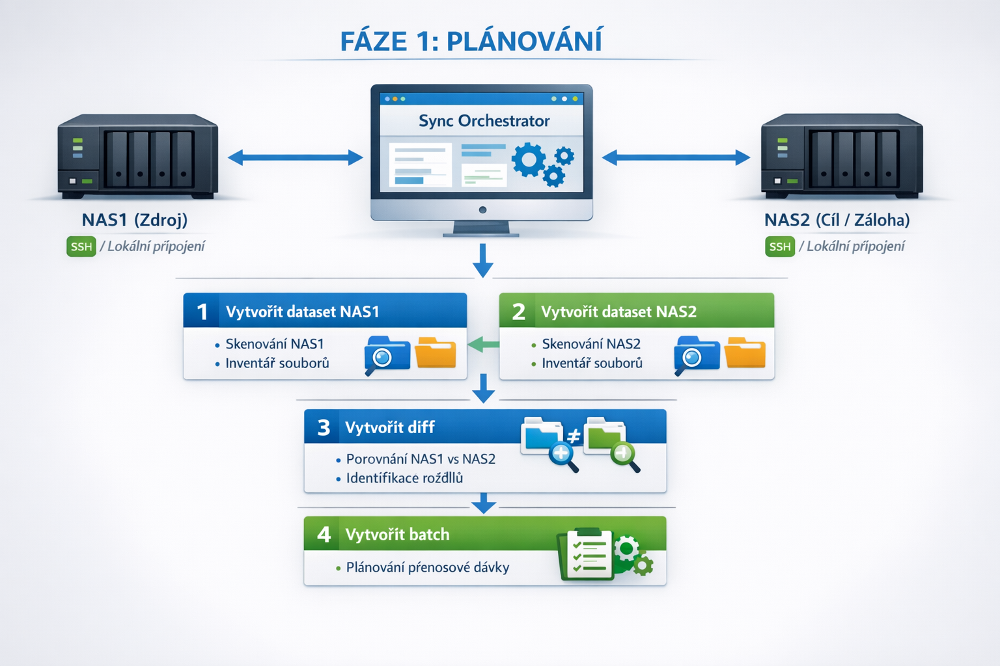
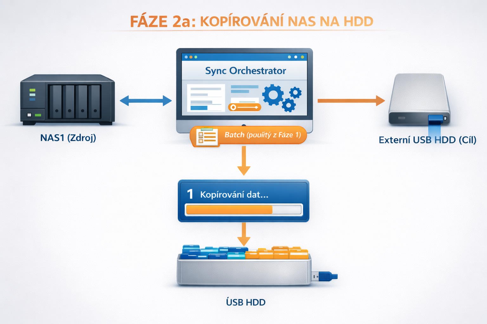
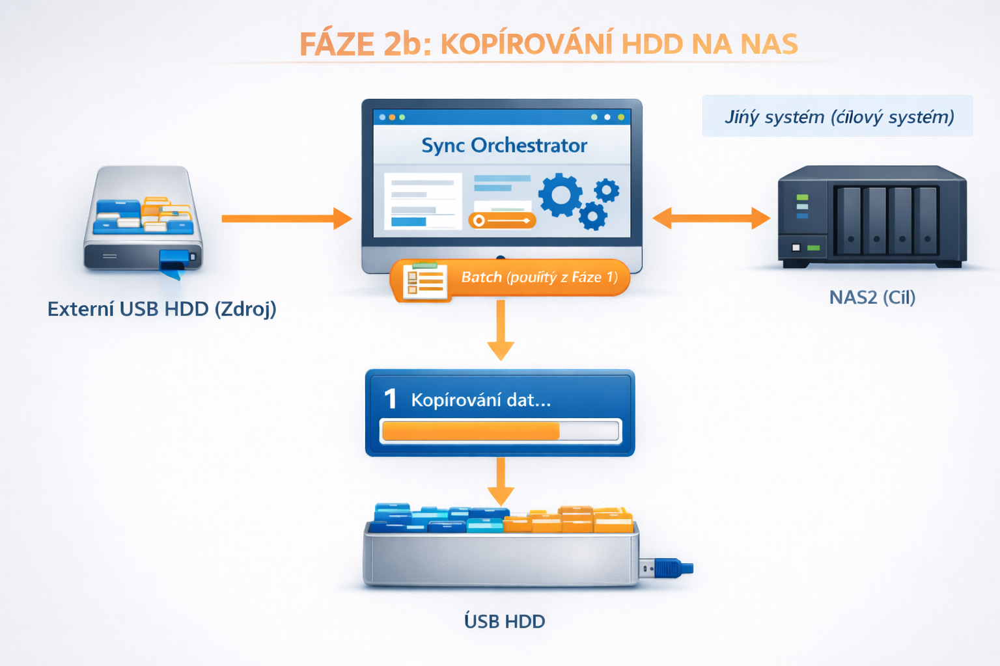

# Sync Orchestrator

Bezpečný a řízený orchestrátor pro synchronizaci velkých objemů dat z NAS1 přes USB na NAS2 bez přímé síťové synchronizace.

## 📋 Popis

Sync Orchestrator je specializovaná aplikace navržená pro bezpečnou synchronizaci velkých objemů dat mezi dvěma NAS servery přes USB disk jako přenosové médium. Aplikace je určena pro situace, kdy není možné nebo žádoucí provádět přímou síťovou synchronizaci mezi NAS servery.

**Hlavní charakteristiky:**

- **Třífázový workflow**: Plánování → Kopírování NAS→HDD (Fáze 2) → Kopírování HDD→NAS (Fáze 3)
- **Bezpečnost**: NAS1 je vždy read-only, konflikty vyžadují explicitní volbu
- **Flexibilita**: Podpora lokálních mountů i SSH připojení
- **Inteligentní plánování**: Respektuje limit USB kapacity, exclude patterns, výběr souborů
- **Real-time monitoring**: WebSocket aktualizace stavu operací

## ✨ Funkce

### Základní funkce

- ✅ **Inventarizace (Scan)**: Vytváření snapshotů souborových metadat
- ✅ **Porovnání (Diff)**: Deterministické porovnání dvou scanů
- ✅ **Plánování přenosu (Plán)**: Inteligentní plánování přenosu s respektováním limitu USB
- ✅ **Kopírování (Copy)**: Bezpečný přenos dat pomocí rsync
- ✅ **SAFE MODE**: Ochrana databáze při odpojení USB
- ✅ **Real-time UI**: WebSocket aktualizace stavu operací
- ✅ **SSH podpora**: NAS1 a NAS2 mohou být dostupné přes SSH

### Pokročilé funkce

- ✅ **Exclude Patterns**: Automatické filtrování nežádoucích souborů (`.DS_Store`, `Thumbs.db`, `*.tmp`, Synology `@eaDir`, atd.)
- ✅ **Výběr souborů**: Možnost povolit/zakázat konkrétní soubory v plánu pomocí checkboxů (optimalizované hromadné označení)
- ✅ **Export do CSV**: Export seznamu souborů v plánu do CSV formátu (cesta, velikost)
- ✅ **Historie jobů**: Zobrazení posledních jobů s možností zobrazení detailu a mazání
- ✅ **Automatické migrace**: Databáze se automaticky migruje při startu
- ✅ **Background jobs**: Asynchronní zpracování dlouhotrvajících operací
- ✅ **Procházení adresářů**: Interaktivní procházení lokálních i SSH adresářů pro výběr root složky

## 📖 Použití

Aplikace je rozdělena na **tři hlavní fáze**, které odpovídají skutečnému procesu synchronizace:

### Základní workflow

1. **Fáze 1 - Plánování**: Vytvořte datasety, proveďte scany a vytvořte plán přenosu
2. **Fáze 2 - Kopírování NAS→HDD**: Zkopírujte data z NAS1 na USB disk
3. **Fáze 3 - Kopírování HDD→NAS**: Zkopírujte data z USB disku na NAS2

### Fáze 1: Plánování (na zdrojovém systému)

**Účel:** Vytvořit plán synchronizace porovnáním NAS1 a NAS2.

**Požadavky:**

- NAS1 musí být dostupný (může být přes SSH)
- NAS2 musí být dostupný (může být přes SSH)
- USB HDD musí být dostupný

**Workflow:**

1. Vytvořte dataset pro NAS1 (na záložce "Datasety")
   - Pro lokální adapter použijte tlačítko "Procházet" pro interaktivní výběr root složky
   - Pro SSH adapter použijte tlačítko "Procházet SSH hosta" pro procházení vzdáleného serveru
2. Vytvořte dataset pro NAS2
3. Spusťte scan NAS1 datasetu - vytvoří se inventura souborů na NAS1
4. Spusťte scan NAS2 datasetu - vytvoří se inventura souborů na NAS2
5. **Porovnání:** Vytvořte diff: NAS1 (source) → NAS2 (target) - identifikuje, co je na NAS1 a chybí na NAS2
6. **Plán přenosu:** Vytvořte plán z diffu - plán kopírování s respektováním limitu USB kapacity
   - Můžete přidat výjimky (exclude patterns) pro soubory, které se nebudou kopírovat
   - Můžete ručně vybrat, které soubory se zkopírují pomocí checkboxů

**Výsledek:** Plán, který se použije ve fázi 2 pro kopírování.



### Fáze 2: Kopírování NAS → HDD (na zdrojovém systému)

**Účel:** Zkopírovat data z NAS1 na USB HDD podle batchu vytvořeného ve fázi 1.

**Požadavky:**

- NAS1 musí být dostupný
- USB HDD musí být dostupný a zapisovatelný

**Workflow:**

1. Vyberte plán vytvořený ve fázi 1
2. Spusťte kopírování NAS1 → USB HDD
3. Po dokončení odpojte HDD a fyzicky ho přeneste na cílový systém

**Výsledek:** Data zkopírovaná na USB HDD.



### Fáze 3: Kopírování HDD → NAS (na cílovém systému)

**Účel:** Zkopírovat data z USB HDD na NAS2 podle stejného batchu z fáze 1.

**Požadavky:**

- USB HDD (s daty z fáze 2) musí být dostupný
- NAS2 musí být dostupný (může být přes SSH)

**Workflow:**

1. Připojte USB HDD s daty zkopírovanými ve fázi 2
2. Vyberte stejný plán, který byl použit ve fázi 2 (plán je uložen na HDD v databázi)
3. Spusťte kopírování USB HDD → NAS2

**Výsledek:** Data zkopírovaná na cílový NAS2.



## 🚀 Deployment

### Předpoklady

- Docker a Docker Compose
- Přístup k mount pointům pro USB (vždy lokální)
- Přístup k NAS1 a NAS2 (mohou být přes SSH nebo lokální mount)

### Docker Compose

Aplikace je připravena pro spuštění pomocí Docker Compose. Soubor `docker-compose.yml` obsahuje veškerou potřebnou konfiguraci.

#### Spuštění

```bash
docker compose up -d --build
```

Aplikace bude dostupná na `http://localhost:8000`

#### Konfigurace

Aplikace je konfigurována pomocí `docker-compose.yml`:

```yaml
services:
  app:
    build:
      context: .
      dockerfile: Dockerfile
    container_name: nas-sync-orchestrator
    ports:
      - "8000:8000"
    volumes:
      - usb:/mnt/usb:rw
      - nas2:/mnt/nas2:rw
    environment:
      - LOG_LEVEL=INFO
      - DATABASE_PATH=/mnt/usb/sync_orchestrator.db
    restart: unless-stopped

volumes:
  usb:
    driver: local
    driver_opts:
      type: none
      o: bind
      device: /path/to/usb  # Upravte podle vašeho systému
  nas2:
    driver: local
    driver_opts:
      type: none
      o: bind
      device: /path/to/nas2  # Volitelné, lze použít SSH
```


#### Update aplikace

```bash
docker compose pull
docker compose up -d
```

#### Rollback na konkrétní verzi

V `docker-compose.yml` změňte image tag:

```yaml
services:
  app:
    image: ghcr.io/elvisek2020/web-sync_orchestrator:sha-<commit-sha>
```

### GitHub a CI/CD

#### Inicializace repozitáře

1. **Vytvoření GitHub repozitáře**:

   - Repozitář: `elvisek2020/web-sync_orchestrator`
   - URL: `git@github.com:elvisek2020/web-sync_orchestrator.git`
2. **Inicializace lokálního repozitáře**:

   ```bash
   git init
   git add .
   git commit -m "Initial commit"
   git branch -M main
   git remote add origin git@github.com:elvisek2020/web-sync_orchestrator.git
   git push -u origin main
   ```
3. **Vytvoření GitHub Actions workflow**:

   Workflow je již připraven v `.github/workflows/docker.yml` - automaticky se spustí po push do `main` branch.
4. **Nastavení viditelnosti image**:

   - Po prvním buildu jděte na GitHub → Packages
   - Najděte vytvořený package `web-sync_orchestrator`
   - V Settings → Change visibility nastavte na **Public** (pokud chcete veřejný image)

#### Commitování změn a automatické buildy

1. **Proveďte změny v kódu**
2. **Commit a push**:

   ```bash
   git add .
   git commit -m "Popis změn"
   git push origin main
   ```
3. **Automatický build**:

   - Po push do `main` branch se automaticky spustí GitHub Actions workflow
   - Vytvoří se Docker image pro `linux/amd64` a `linux/arm64`
   - Image se nahraje do GHCR
   - Taguje se jako `latest` a `sha-<commit-sha>`
4. **Sledování buildu**:

   - GitHub → Actions → zobrazí se běžící workflow
   - Po dokončení je image dostupná na `ghcr.io/elvisek2020/web-sync_orchestrator:latest`

#### GitHub Container Registry (GHCR)

Aplikace je dostupná jako Docker image z GitHub Container Registry:

- **Latest**: `ghcr.io/elvisek2020/web-sync_orchestrator:latest`
- **Konkrétní commit**: `ghcr.io/elvisek2020/web-sync_orchestrator:sha-<commit-sha>`

Image je **veřejný** (public), takže není potřeba autentizace pro pull.

## 🔧 Technická dokumentace

### 🏗️ Architektura

Aplikace je postavena jako **FastAPI backend** s **React SPA frontendem**:

- **Backend**: FastAPI s WebSocket podporou, SQLAlchemy ORM, adapter pattern pro různé typy připojení
- **Frontend**: React SPA s React Router, real-time aktualizace přes WebSocket
- **Databáze**: SQLite uložená na USB disku pro přenositelnost mezi systémy
- **Background jobs**: Threading pro asynchronní zpracování dlouhotrvajících operací
- **Adapter pattern**: Flexibilní podpora lokálních mountů i SSH připojení

**Klíčové charakteristiky:**

- **Modulární design**: Adaptery pro scan a transfer operace
- **Bezpečnost**: SAFE MODE chrání databázi při odpojení USB
- **Real-time**: WebSocket pro okamžité aktualizace UI
- **Audit trail**: Kompletní historie všech operací

### Technický stack

**Backend:**

- FastAPI (Python 3.11+)
- SQLAlchemy (ORM)
- WebSockets pro real-time komunikaci
- Uvicorn jako ASGI server
- Python logging s konfigurovatelnou úrovní
- rsync pro přenos souborů

**Frontend:**

- React 18+
- React Router pro navigaci
- Axios pro HTTP komunikaci
- WebSocket API pro real-time aktualizace
- Vite jako build tool

**Deployment:**

- Docker (multi-stage build)
- Docker Compose

### 📁 Struktura projektu

```
.
├── backend/              # FastAPI backend
│   ├── api/             # API endpoints
│   │   ├── batches.py   # Plán management (CRUD, items, summary, export, toggle-all)
│   │   ├── copy.py      # Copy operations (nas1-usb, usb-nas2, jobs CRUD)
│   │   ├── datasets.py  # Dataset management (CRUD, SSH test)
│   │   ├── diffs.py     # Diff management (CRUD, items, summary)
│   │   ├── health.py    # Health check
│   │   ├── mounts.py    # Mount status
│   │   └── scans.py     # Scan management (CRUD, files)
│   ├── adapters/        # Adapter pattern pro scan a transfer
│   │   ├── base.py      # Base třídy
│   │   ├── factory.py   # Factory pro vytváření adapterů
│   │   ├── local_scan.py      # Lokální scan adapter
│   │   ├── local_transfer.py   # Lokální rsync transfer adapter
│   │   ├── ssh_scan.py         # SSH scan adapter
│   │   └── ssh_transfer.py     # SSH rsync transfer adapter
│   ├── config.py        # Globální konfigurace (exclude patterns)
│   ├── database.py      # SQLAlchemy modely
│   ├── job_runner.py    # Background job runner
│   ├── main.py          # FastAPI aplikace
│   ├── mount_service.py # Mount monitoring service
│   ├── storage_service.py # Database service s migracemi
│   └── websocket_manager.py # WebSocket manager
├── ui/                   # React SPA
│   ├── src/
│   │   ├── pages/       # Stránky aplikace
│   │   │   ├── Dashboard.jsx    # Přehled stavu a fáze
│   │   │   ├── Datasets.jsx     # Správa datasetů
│   │   │   ├── Scan.jsx         # Spuštění scanu
│   │   │   ├── Compare.jsx      # Porovnání (diffy)
│   │   │   ├── PlanTransfer.jsx  # Plán přenosu (vytváření plánů, fáze 1)
│   │   │   ├── CopyNasToHdd.jsx  # Kopírování NAS → HDD (fáze 2)
│   │   │   ├── CopyHddToNas.jsx  # Kopírování HDD → NAS (fáze 3)
│   │   │   └── Logs.jsx         # Historie jobů
│   │   ├── hooks/       # React hooks
│   │   │   ├── useMountStatus.js # Hook pro mount status
│   │   │   └── useWebSocket.js   # Hook pro WebSocket
│   │   └── App.jsx      # Hlavní aplikace s routingem
│   ├── images/          # Obrázky workflow
│   └── ...
├── Dockerfile            # Multi-stage build (frontend + backend)
├── docker-compose.yml    # Docker Compose konfigurace
└── README.md
```

### 🔧 API dokumentace

#### REST API

Aplikace poskytuje REST API na `/api/*`:

**Hlavní endpointy:**

- `GET /api/health` - Health check
- `GET /api/mounts/status` - Status mountů
- `GET /api/datasets/` - Seznam datasetů
- `POST /api/datasets/` - Vytvoření datasetu
- `GET /api/datasets/{dataset_id}/browse` - Procházení adresářů (SSH nebo lokální)
- `GET /api/datasets/browse-local` - Procházení lokálních adresářů (bez datasetu, pro nové datasety)
- `GET /api/scans/` - Seznam scanů
- `POST /api/scans/` - Spuštění scanu
- `GET /api/diffs/` - Seznam diffů
- `POST /api/diffs/` - Vytvoření diffu
- `GET /api/batches/` - Seznam plánů
- `POST /api/batches/` - Vytvoření plánu
- `PUT /api/batches/{batch_id}/items/{item_id}/enabled` - Povolit/zakázat soubor
- `PUT /api/batches/{batch_id}/items/toggle-all` - Povolit/zakázat všechny soubory najednou
- `DELETE /api/batches/{batch_id}` - Smazat plán
- `GET /api/copy/jobs` - Seznam copy jobů
- `GET /api/copy/jobs/{job_id}` - Detail copy jobu
- `GET /api/copy/jobs/{job_id}/files` - Seznam souborů v copy jobu s jejich stavy
- `DELETE /api/copy/jobs` - Smazat všechny copy joby
- `DELETE /api/copy/jobs/{job_id}` - Smazat konkrétní copy job
- `POST /api/copy/nas1-usb` - Kopírování NAS1 → USB
- `POST /api/copy/usb-nas2` - Kopírování USB → NAS2

**Whitelisted endpointy (dostupné i v SAFE MODE):**

- `GET /api/health`
- `GET /api/mounts/status`
- `WebSocket /ws`

#### WebSocket endpoint

**URL**: `ws://localhost:8080/ws`

WebSocket poskytuje real-time aktualizace:

- `job.started` - Job byl spuštěn
- `job.progress` - Průběh jobu (scan, diff, copy)
- `job.finished` - Job byl dokončen
- `mount.status` - Změna stavu mountů

### 💻 Vývoj

#### Přidání nových funkcí

1. **Backend změny**:

   - API endpoints: `backend/api/`
   - Business logika: `backend/job_runner.py`
   - Adaptery: `backend/adapters/`
   - Datový model: `backend/database.py`
2. **Frontend změny**:

   - UI komponenty: `ui/src/pages/`
   - Hooks: `ui/src/hooks/`
   - Routing: `ui/src/App.jsx`
   - Styly: Používejte box-style komponenty (viz `ui/src/pages/*.css`)

#### Testování

- **Backend**: API endpointy lze testovat pomocí FastAPI auto-dokumentace na `http://localhost:8000/docs`
- **Frontend**: React dev server běží na `http://localhost:5173` (nebo jiném portu podle Vite)
- **Integrace**: Spusťte Docker Compose pro testování celé aplikace

#### Debugging

- Nastavte `LOG_LEVEL=DEBUG` v `docker-compose.yml` pro detailní logy
- Server loguje všechny důležité události s timestampy
- Frontend loguje chyby do konzole prohlížeče
- WebSocket zprávy jsou logovány v konzoli prohlížeče

#### Úroveň logování (`LOG_LEVEL`)

- `DEBUG` - zobrazí všechny logy včetně detailních debug informací (vývoj)
- `INFO` - zobrazí informační logy (výchozí, vhodné pro testování)
- `WARNING` - zobrazí pouze varování a chyby (doporučeno pro produkci)
- `ERROR` - zobrazí pouze chyby (minimální logování)
- `CRITICAL` - zobrazí pouze kritické chyby

Pro produkci doporučujeme nastavit `LOG_LEVEL=WARNING` nebo `LOG_LEVEL=ERROR`.

### 🎨 UI/UX

Aplikace používá **box-style komponenty** pro konzistentní vzhled:

- Všechny komponenty mají boxový vzhled s rámečky
- Konzistentní barvy a rozestupy
- Responzivní design
- Real-time aktualizace přes WebSocket
- Indikace fáze synchronizace v hlavičce

**Záložky aplikace:**

1. **Dashboard** - Přehled stavu, mountů, nedávných jobů, test SSH připojení
2. **Datasety** - Správa datasetů (vytváření, úprava, mazání)
   - **Procházení adresářů**: Pro lokální i SSH adaptéry je k dispozici tlačítko "Procházet" pro interaktivní výběr root složky
3. **Scan** - Spuštění scanu pro dataset s real-time progress
4. **Porovnání** - Vytváření a správa diffů (dostupné pouze ve fázi 1)
5. **Plán přenosu** - Vytváření a správa plánů (dostupné pouze ve fázi 1)
6. **Kopírování NAS → HDD** - Kopírování podle plánu s real-time progress (dostupné ve fázi 2)
7. **Kopírování HDD → NAS** - Kopírování podle plánu s real-time progress (dostupné ve fázi 3)

### 📝 Historie změn

#### v.20250103.0952 (aktuální)

- ✅ **Přepínání mezi fázemi**: Při přepínání mezi fází 2 a 3 se přesměruje přímo na záložku kopírování
- ✅ **Obnovení progress baru**: Po návratu na záložku Kopírování se zobrazí progress bar, pokud job ještě běží
- ✅ **Filtrování souborů**: Ve fázi 2 a 3 se zobrazují pouze vybrané (enabled) soubory v seznamu
- ✅ **Odebrán sloupec USB LIMIT %**: Odstraněn ze všech záložek
- ✅ **Přejmenování Batchy → Plány**: Změněno ve všech záložkách
- ✅ **Detail jobu s jednotlivými soubory**: Zobrazuje stav každého souboru (cesta, velikost, status, chybová zpráva)
- ✅ **Adresářová struktura na HDD**: Každý job vytváří vlastní adresář `job-{job_id}` na USB disku pro oddělení různých jobů
- ✅ **Ukládání stavu souborů**: Nová tabulka `job_file_statuses` pro sledování stavu každého zkopírovaného souboru

#### v.20250103.0938

- ✅ **Rozdělené záložky podle fází**: Každá fáze má vlastní záložku (Plán přenosu, Kopírování NAS→HDD, Kopírování HDD→NAS)
- ✅ **Přejmenování fází**: Fáze 2a → Fáze 2, Fáze 2b → Fáze 3
- ✅ **Přejmenování Batch → Plán**: Terminologie změněna z Batch/Batchy na Plán/Plány
- ✅ **Optimalizované hromadné označení**: Rychlé povolení/zakázání všech souborů v plánu (nový endpoint `/api/batches/{batch_id}/items/toggle-all`)
- ✅ **Historie jobů**: Zobrazení posledních jobů s možností zobrazení detailu a mazání
- ✅ **Nápověda k zakázaným tlačítkům**: Tooltip vysvětluje, proč je tlačítko zakázané
- ✅ **Opravený progress bar**: Správné zobrazení průběhu kopírování s ignorováním informačních řádků rsync
- ✅ **Log z kopírování**: Log zprávy z kopírování se ukládají do databáze a zobrazují v detailu jobu
- ✅ **Indikace dokončování**: Progress bar zobrazuje "Dokončování kopírování..." když jsou všechny soubory ve frontě
- ✅ **Zmenšené obrázky fází**: Obrázky fází zmenšeny o 1/4 (z 75% na 56.25%)
- ✅ **Zjednodušený formulář**: Formulář Výjimky zmenšen na jeden řádek (input místo textarea)
- ✅ **Odebrán sloupec USB LIMIT %**: Z tabulky plánů odebrán sloupec USB LIMIT %
- ✅ **Odebrán potvrzovací dialog**: Při vytvoření plánu a mazání jobů není potřeba potvrzování

#### v.20260103.0300

- ✅ **Základní infrastruktura**: Docker, FastAPI, React
- ✅ **Datový model**: Kompletní SQLAlchemy modely
- ✅ **API endpoints**: Všechny CRUD operace
- ✅ **Adaptery**: Lokální a SSH adaptéry pro scan a transfer
- ✅ **Workflow**: SCAN, DIFF, BATCH, COPY
- ✅ **Exclude patterns**: Automatické filtrování nežádoucích souborů
- ✅ **Výběr souborů**: Checkboxy pro povolení/zakázání souborů
- ✅ **Export do CSV**: Export seznamu souborů
- ✅ **Rozdělené záložky**: Porovnání a Plán přenosu
- ✅ **Real-time UI**: WebSocket aktualizace
- ✅ **SAFE MODE**: Ochrana databáze při odpojení USB
- ✅ **Automatické migrace**: Databázové migrace při startu
- ✅ **Procházení adresářů**: Interaktivní procházení lokálních i SSH adresářů pro výběr root složky

### 🐛 Známé problémy

- Na macOS s Docker Desktop není možné použít lokální mount pro SMB/CIFS disky - použijte SSH adapter
- SQLite databáze musí být na USB disku pro přenositelnost mezi systémy

### 📚 Další zdroje

- [FastAPI dokumentace](https://fastapi.tiangolo.com/)
- [React dokumentace](https://react.dev/)
- [SQLAlchemy dokumentace](https://www.sqlalchemy.org/)
- [WebSocket API](https://developer.mozilla.org/en-US/docs/Web/API/WebSocket)
- [Docker dokumentace](https://docs.docker.com/)
- [rsync dokumentace](https://rsync.samba.org/documentation.html)

## Bezpečnost

- NAS1 je vždy read-only
- Konflikty se nikdy neřeší automaticky - vyžadují explicitní volbu uživatele
- SAFE MODE chrání databázi při odpojení USB
- Všechny operace jsou auditovatelné (JobRun záznamy)
- Exclude patterns chrání před kopírováním systémových souborů

## Databáze

SQLite databáze je uložena na USB disku (`/mnt/usb/sync_orchestrator.db`). Aplikace automaticky detekuje připojení/odpojení USB a přepíná do SAFE MODE při nedostupnosti.

**Důležité:** Plán vytvořený ve fázi 1 je uložen v databázi na USB, takže je dostupný i na cílovém systému ve fázi 3.

### Datový model

- **Dataset**: Logická migrační jednotka (NAS1/USB/NAS2) s konfigurací adapterů
- **Scan**: Snapshot souborových metadat pro dataset
- **FileEntry**: Záznam o souboru ve scanu
- **Diff**: Porovnání dvou scanů
- **DiffItem**: Výsledek diffu pro konkrétní soubor (missing/same/conflict)
- **Batch (Plán)**: Plán přenosu založený na diffu (s exclude patterns)
- **BatchItem**: Konkrétní soubor v plánu (s enabled flagem)
- **JobRun**: Audit záznam operací (scan, diff, copy)

### Automatické migrace

Aplikace automaticky provádí migrace databáze při startu:

- Přidání `error_message` do `scans`
- Přidání `exclude_patterns` do `batches`
- Přidání `enabled` do `batch_items`
- Přidání `job_log` do `job_runs`
- Vytvoření tabulky `job_file_statuses` pro sledování stavu souborů

## 📄 Licence

Tento projekt je vytvořen pro vzdělávací účely.

---

## 🤝 Contributing

Tento projekt je vytvořen pro specifické použití. Pokud máte návrhy na vylepšení, otevřete issue nebo vytvořte pull request.
